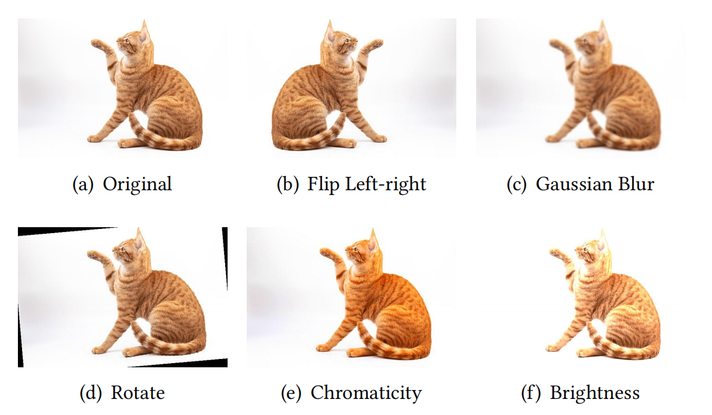

# CMPS++: Uncertainty and Diversity Driven Metamorphic Test Case Pair Selection for Deep Neural Networks

This folder serves as the replication package for the paper: “CMPS++: Uncertainty and Diversity Driven Metamorphic Test Case Pair Selection for Deep Neural Networks”. It includes the source code of the proposed approach and baselines, all necessary scripts to reproduce the experiments, the data required for running the experiments, and the original experimental results.

---

## Folder Structure

```
.
├── Input_data
│   ├── Fault_clusters
│   ├── Pretrained_model
│   └── Retrain
├── Experiment_results
│   ├── RQ1
│   ├── RQ2&3
│   └── RQ4
├── Readme.md
├── requirements.txt
└── Source_code
```

## Requirements

The `requirements.txt` lists the dependencies required to run the Python code.
Run the following command to install dependency packages:

```
pip install -r requirements.txt
```

## CMPS++

The `Source_code\cmps_extend.py`file contains the implementation of  the **CMPS++** approach.
Run the following function to perform MP selection for a given test selection problem:

```python
def cmps_extend (ori_mdata,mr_mdata,budget)
```
The input parameters include:

* `ori_mdata`: ori_data[0] = filenames, ori_data[1] = source_labels,ori_data[2] = output probabilities of source (dist)
* `mr_mdata`: mr_mdata[0] = mr1.dict(){filenames: follow-up_labels, output probabilities of follow-ups} ( a list of dist)
* `budget`: test budget (int)

The output will be  a TRC and  a FDR value calculated by the selected MPs.

## Reproducing Experiments

### 1) Experimental Subjects

In our experiments, we selected four datasets and assigned two DNN models to each dataset, i.e., a total of eight experimental subjects, as follows:

| Dataset       | Test Set | DNN Model    |
|:-------------:|:--------:|:-------------:|
| Fashion-MNIST | 10,000   | LeNet1        |
|               |          | LeNet5        |
| CIFAR-10      | 10,000   | VGG19         |
|               |          | ResNet50      |
| ImageNet      | 10,000   | GoogleNet     |
|               |          | ResNet50      |
| Fruit-360     | 10,000    | MobileNetV2   |
|               |          | ShuffleNet    |`

We provide all the datasets and pretrained DNN models in the `Input_data\Subjects` folder.

### 2) Metamorphic Relations (MRs)

We selected five different MRs:

* **MR1 - Flip Left-right** : The DNN model’s outputs should remain consistent when the image is flipped from left to right.
* **MR2 - Gaussian Blur** : The DNN model’s outputs should remain consistent when the image undergoes Gaussian blurring.
* **MR3 - Rotate 5°** : The DNN model’s outputs should remain consistent when the image is rotated by 5&deg;.
* **MR4 - Change Chromaticity** : The DNN model’s outputs should remain consistent when the chromaticity of the image is increased.
* **MR5 - Adjust Brightness** : The DNN model’s outputs should remain consistent when the brightness of the image is increased.

Here's an example demonstrating how MRs transform the source test case into its follow-up test cases.



The implementations of these five MRs are in the `mr_5.py` file under the `src` folder. You can also add new MRs based on your own needs.

For **easy replication**, each subfolder in the `Input_data` directory contains data for the corresponding experimental subjects, including the model's predicted labels for the source test cases, output probabilities of source test cases, and predicted labels for the follow-up test cases. This way, you can directly read the corresponding `.mat` files of each subject for processing without the need to load and run the models. Taking the `cifar10_vgg19` folder as an example, the results of each MR are stored separately in their respective `.mat` files, totaling five files.


### 3) Baseline Approaches

* **CMPS** : We directly used the [replication package](https://github.com/GIST-NJU/CMPS) provided by the original paper "​*CMPS: Cluster-Based Multi-Objective Metamorphic Test Case Pair Selection for Deep Neural Networks*​"
* **MPSS** : We directly used the [replication package](https://github.com/Napoleon4th/MPSS) provided by the original paper "​*Boosting the Cost-Effectiveness of Metamorphic Test Case Pair Selection for Deep Learning Testing with Surrogate Model*​"
* **NSGA-II** : We directly used the [replication package](https://doi.org/10.5281/zenodo.6389008) provided by the original paper "​*Multi-Objective Metamorphic Follow-up Test Case Selection for Deep Learning Systems*​"
  Run the following command to obtain the TRCs of the NSGA-II's raw results :
  `python NSGA-II.py`
  We also store the original random selection results of NSGA-II from our experiment in the `results` subfolder within the `NSGA-II` directory. The storage format is a list of length 10, where each element is a list of length 5, corresponding to the indices of source test cases selected for each of the five MRs.
* **Random Selection (RS)** : The `Source_code/random_selection.py` file provides the implementation of the RS approach.
  Run the following function to perform MP selection:
  `python random_selection.py`
  We also store the original RS results from our experiment in the `RS` subfolder within the `results` directory. The storage format consists of index pairs `(i, j)`, where `i` represents the MR index and `j` represents the source test case index.


